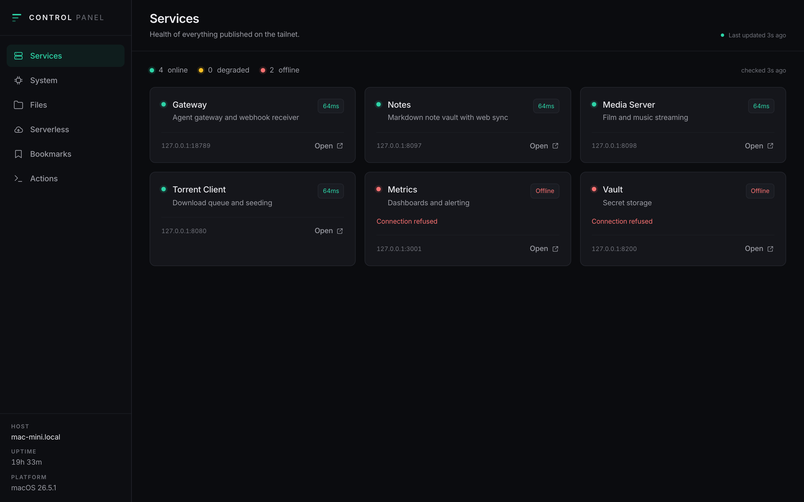
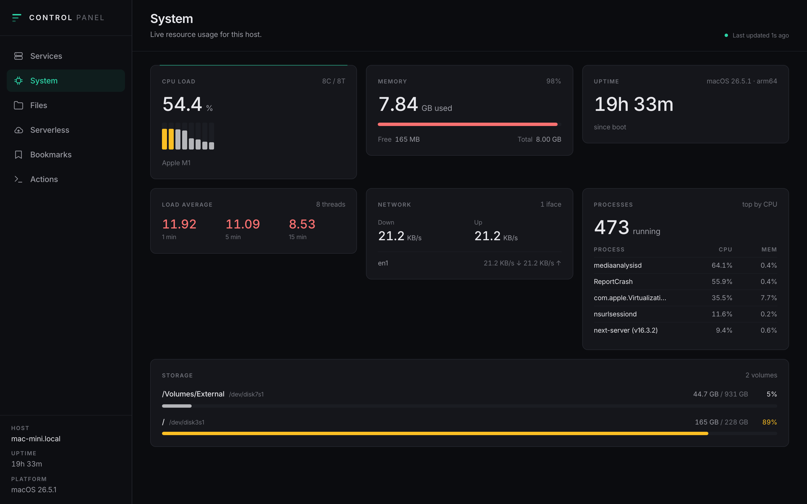
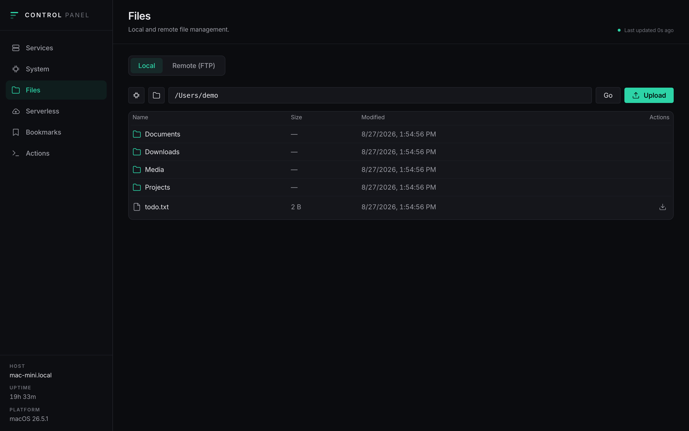
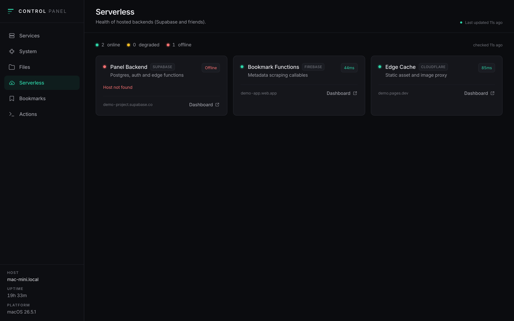
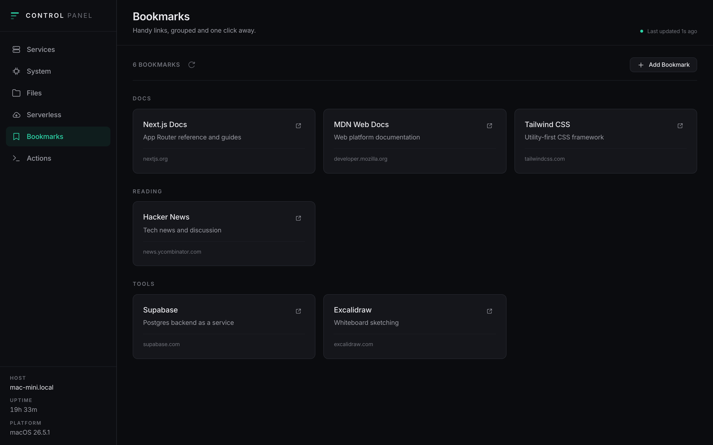
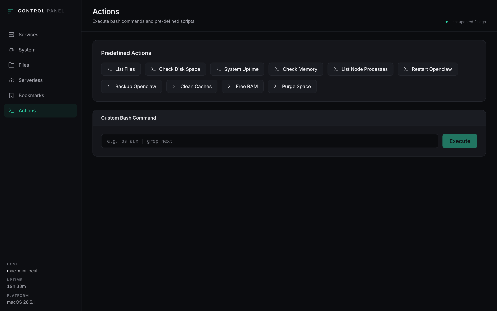

# admin-panel

A self-hosted dashboard for a personal Mac mini server: watch system load, reach
the services running on it, browse files locally or over FTP, check cloud
functions, keep bookmarks, and run a small set of maintenance commands.

Built with Next.js 16 (App Router), React 19, Tailwind 4, and TypeScript. It
runs in production mode on port `8096` under a macOS `launchd` agent.

## Screenshots

> Captured against a throwaway instance seeded with fake data — the services,
> bookmarks, cloud projects, hostname and paths below are all placeholders.

### Services
Every self-hosted app with a live reachability probe and round-trip latency.



### System
CPU per core, memory, load average, network throughput, top processes and volumes.



### Files
Browse the local filesystem or connect to a remote host over FTP.



### Serverless
Hosted backends across Supabase, Firebase and Cloudflare, probed the same way.



### Bookmarks
Saved links grouped by category, with metadata filled in automatically.



### Actions
Predefined maintenance commands plus an arbitrary bash escape hatch.



## Tabs

- **Services** — the self-hosted apps on the box, each with a local and tailnet
  URL and a live reachability dot.
- **System** — CPU (per-core), memory, disk, network throughput, and the top
  processes by CPU, polled from `systeminformation`.
- **Files** — a browser for the local filesystem plus an FTP client (upload,
  download, navigate) backed by `basic-ftp`.
- **Serverless** — the deployed Firebase and Supabase functions and their state.
- **Bookmarks** — saved links whose title/description/favicon are filled in
  automatically by a Supabase edge function, with direct scraping as a fallback.
- **Actions** — one-click shell commands (restart the gateway, run backups,
  clear caches) with stdout and stderr streamed back into the page.

## Getting started

```bash
npm install
cp .env.example .env.local   # then fill it in
npm run dev                  # http://localhost:3000
```

Every variable in `.env.example` is optional. With none of them set the panel
runs entirely off the gitignored `data/*.json` fallback store, which is enough to
boot it and click around.

## Configuration

Operator-specific data — service hostnames, tailnet names, cloud project refs,
bookmarks, credential paths — is deliberately kept out of the repository. It
lives in one of two places:

- **Supabase**, in the tables `panel_services`, `panel_serverless` and
  `panel_bookmarks` (schema under `supabase/migrations/`). Used when both
  `SUPABASE_URL` and `SUPABASE_SERVICE_ROLE_KEY` are set.
- **`data/*.json`**, a gitignored local fallback used when Supabase is not
  configured or is unreachable, so the panel still renders offline.

Both are read through `src/lib/panel-store.ts`. The files under `src/config/`
define **types only** — adding a service or a bookmark means inserting a row, not
editing source. Seed a fresh Supabase project with:

```bash
SUPABASE_URL=... SUPABASE_SERVICE_ROLE_KEY=... node scripts/seed-supabase.mjs
```

## API routes

| Route | Purpose |
| --- | --- |
| `GET /api/system` | Host metrics: CPU, memory, disk, network, processes |
| `GET /api/services` | Configured services and their reachability |
| `GET /api/serverless` | Deployed cloud functions |
| `GET`/`POST`/`DELETE` `/api/bookmarks` | Bookmark CRUD |
| `POST /api/webhook/bookmark` | Create a bookmark with generated metadata |
| `POST /api/actions` | Execute a predefined shell command |
| `/api/fs/*` | Local filesystem list, upload, download |
| `/api/ftp/*` | FTP connect, list, upload, download, disconnect |

## Deployment

The panel runs under `launchd` as `com.openclaw.admin-panel`, defined in
`~/Library/LaunchAgents/com.openclaw.admin-panel.plist`. To ship a change:

```bash
npm run build
launchctl kickstart -k gui/$(id -u)/com.openclaw.admin-panel
curl -sI http://127.0.0.1:8096/
```

Logs go to `logs/admin.log` and `logs/admin.err.log`.

One gotcha worth knowing: `launchd` does not inherit your shell `PATH`. The
plist's `PATH` must include `/usr/sbin:/sbin`, because `systeminformation`
shells out to `diskutil`, `ioreg` and `sysctl` — without them the System tab
silently returns empty disk and hardware data.

## Security

**`POST /api/actions` executes shell commands and has no authentication.** The
panel assumes it is reachable only from loopback or a trusted tailnet. Do not
expose it to the public internet, and add an auth layer before widening access.

`.env*`, `.firebaserc` and `data/` are gitignored and must stay that way — see
`.env.example` and `.firebaserc.example` for the shape of each.
